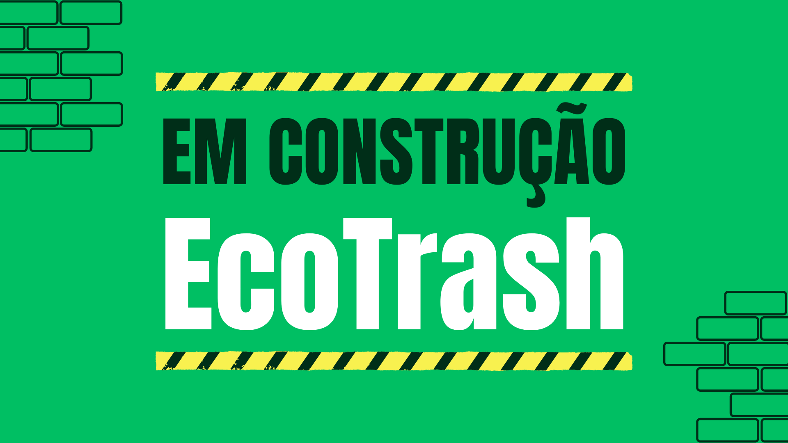

<h1 align="center">Projeto de Aplicação</h1>

 Sistema com objetivo de coleta e retirada de lixo eletrônico visando informar pontos de coleta tanto fixos quanto móveis em sua cidade, permitindo o cadastro por parte de empresas ou de usuários que preenchem certos requisitos.

 

  

