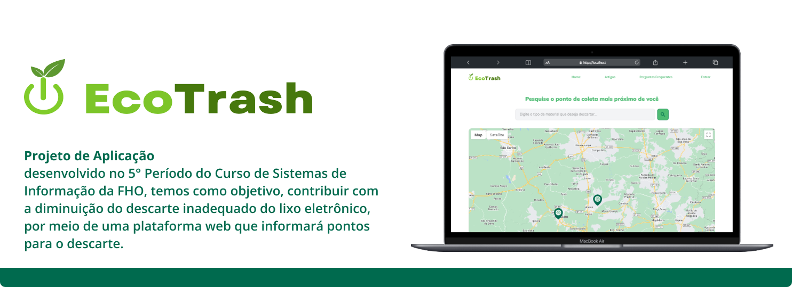
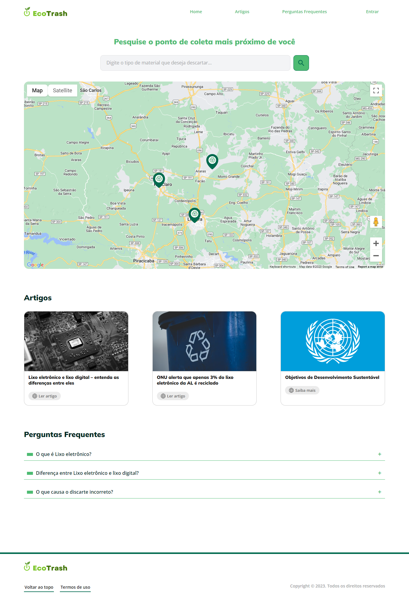

<h1 align="center">Projeto de Aplicação</h1>

<p align="center">
 Sistema com objetivo de coleta e retirada de lixo eletrônico visando informar pontos de coleta tanto fixos quanto móveis em sua cidade, permitindo o cadastro por parte de empresas ou de usuários que preenchem certos requisitos.
</p>

<p align="center">
  
</p>

<br>

<h3>Tecnologias Utilizadas</h3>

**Front-end** _(Estetica visual do sistema)_

- HTML
- CSS
- JavaScript

**Back-end** _(Funcionalidade do sistema)_

- PHP

**Banco de Dados** _(Onde ficam armazenado os dados do sistema)_
- MySQL (phpMyAdmin)

<h3>Como utilizar</h3>

Para utilizar o EcoTrash, certifique-se de ter o [Git](https://git-scm.com/downloads) instalado em seu computador. Também será necessário instalar um servidor, recomendamos o [XAMPP](https://www.apachefriends.org/pt_br/download.html). 
Após realizar essas etapas, basta clonar o repositório para a pasta **"htdocs"** no seu disco local, localizada dentro da pasta do XAMPP. Utilize o seguinte comando para clonar o repositório: ```git clone https://github.com/Icaro-Vieira/EcoTrash.git```. 
Feito isso, inicie os serviços do **Apache e MySQL**, clicando no botão **"Start"**. Em seguida, clique no segundo botão **"Admin"** ao lado do MySQL, ao abrir o phpMyAdmin importe o banco de dados localizado na pasta **_database_** e abra o projeto que você clonou, coloque na url do seu navegador: _http://localhost/_.

<h3>Observações</h3>
<p>Para uma experiência melhor de usabilidade do nosso sistema, é recomendado que você utilize um computador ou notebook para executá-lo. Para implementações futuras, faremos a responsividade, tornando-o compatível com aparelhos móveis.</p>

<h3>Página Index do Projeto</h3>
<p align="center">
  
</p>

<h3>Organização do Projeto, branches e suas funções</h3>

- ```master```: Branch com o código revisado e finalizado!;
- ```Development```: Branch responsável pelos códigos que ainda estão sendo desenvolvidos;
- ```Hotfix```: Branch com códigos para realizar os testes, corrigir eventuais erros e por fim passar para a _master_;

<br/>
<br/>

<h3 align="center">GitHub dos Integrantes do Projeto</h3>
<div align="center">
  <a href="https://github.com/Andersonpnascimento" target="_blank">Anderson Prado</a> |
  <a href="https://github.com/brunocirino" target="_blank">Bruno Cirino</a> |
  <a href="https://github.com/Icaro-Vieira" target="_blank">Ícaro Vieira</a> |
  <a href="https://github.com/JessicaMMattos" target="_blank">Jéssica Mattos</a> |
  <a href="https://github.com/MatheusZaguetti" target="_blank">Matheus Zaguetti</a>
</div>
